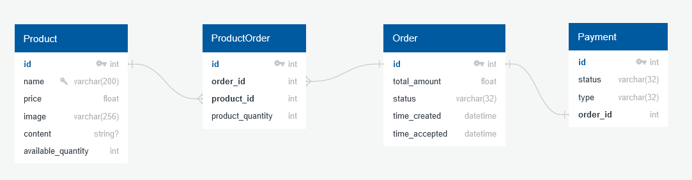

# Описание проекта SmallShop

Этот проект представляет собой простой e-commerce API, разработанный на основе Django 4.2. Проект демонстрирует создание моделей, настройку административной панели и создание API эндпоинтов. Включает в себя функционал для управления товарами, заказами и платежами, а также расширение для админ-панели для подтверждения заказов на основе статуса платежа. 

## Техно-стек

* Python 3.10.11
* Django 4.2
* DRF 3.14.0
* Celery 5.3.4
* Pillow 10.1.0
* Redis 5.0.1
* Gunicorn 21.2.0
* Django-storages 1.14.2
* Httpx 0.25.0
* Nginx 1.25
* Postges 15.1
* Minio 2023.11.20

## Схема БД

[](https://github.com/avnosov3/SmallShop)

## Запуск проекта
0. Выполните следующие команды
```
git clone git@github.com:avnosov3/SmallShop.git
```
```
cd SmallShop
```
1. Создайте файл .env. Можно переименовать .env.example в .env
2. Выполните одну из двух команд
```shell
make up
```
```shell
docker compose up -d
```
3. Чтобы остановить проект - выполните одну из двух команд
```shell
make downv
```
```shell
docker compose down -v
```

## Пути, доступные после запуска проекта

1. [Django admin panel](http://localhost/admin/)
```
логин - admin
пароль - admin
```
2. [Swager](http://localhost/api/v1/swagger/)
3. [Flower](http://localhost/flower/)
4. [Minio](http://localhost:9000/)
```
логин - minioadmin
пароль - minioadmin
```

## Кеширование

Страница `api/v1/products` кешируется. Eсли администратор добавляет новые товары, то у него  
есть возможность очистить кеш из админ панели. Инвалидация кеша происходит через 10800 секунд (3 часа).  
Для проверки инвалидации кеша не забудьте почистить кеш браузера или воспользуйтесь Postman

## Celery

Celery задача отправляет заказ на внешний сервис.
```
CELERY_RETRY_ATTEMPTS=10  # количество попыток
CELERY_WAITING_TIME_BEFORE_NEW_ATTEMPTS=60  # время (секунды) ожидания между попыткам
```
В [Flower](http://localhost/flower/) можно посмотреть статус выполнения задачи. Так как не было  
токена, то задача не будет выполнена, но в flower будет понятное описание ошибки

## Minio

Хранение файлов и статики происходит в Minio.  
В бакете `media` храним файлы.  
В бакете `static` храним статику.  
Админка Minio доступна [тут](http://localhost:9000/)
```
логин - minioadmin
пароль - minioadmin
```

## Команды автоматизации

1. Поднять проект и пересобрать образы
```shell
make upb
```

2. Поднять проект
```shell
make up
```

3. Остановить проект и очистить volume
```shell
make downv
```

4. Остановить проект
```shell
make down
```
